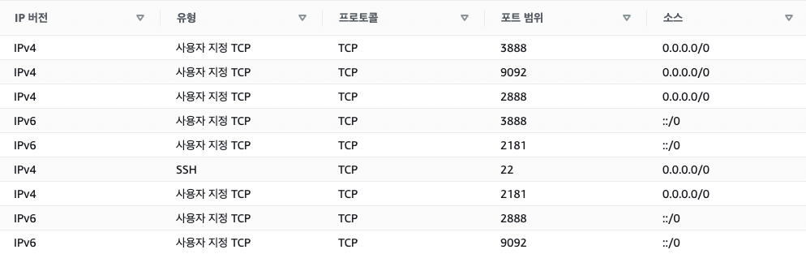

# memento-event-producer
memento Chrome extension의 이벤트 수신 및 Kafka 이벤트 생성기

## Kafka 구성

### EC2 셋업

EC2 3대 기동

- 로컬에서 ssh config host 등록 및, ec2 접속해서 루트계정 작업 해놓을 것
    - sudo passwd root
- ec2에 jdk 1.8.0 설치
    - sudo yum install -y java-1.8.0-openjdk-devel.x86_64
- kafaka 3.1.0 with scala 2.12.0 설치
    - wget **https://dlcdn.apache.org/kafka/3.1.0/kafka_2.13-3.1.0.tgz**
    - tar xvf kafka

### SASL_PLAINTEXT 인증설정

**server.properties 설정 추가 및 변경**

```bash
listeners=SASL_PLAINTEXT://${ec2-private-ip}:9092
security.inter.broker.protocol=SASL_PLAINTEXT
advertised.listeners=SASL_PLAINTEXT://${ec2-public-ip}:9092
sasl.enabled.mechanisms=PLAIN
sasl.mechanism.inter.broker.protocol=PLAIN
authorizer.class.name=kafka.security.authorizer.AclAuthorizer
allow.everyone.if.no.acl.found=true
```

**zookeeper.properties 설정 추가 및 변경**

```bash
authProvider.1=org.apache.zookeeper.server.auth.SASLAuthenticationProvider
requireClientAuthScheme=sasl
jaasLoginRenew=3600000
```

**kafka_server_jaas.conf**

```bash
KafkaServer { # 클라이언트 -> 카프카 서버 인증에 사용
        org.apache.kafka.common.security.plain.PlainLoginModule required
        username="admin"
        password="admin-secret"
        user_admin="admin-secret"
        user_reason="admin-reason";
};

Client { # 카프카 서버 -> 주키퍼 인증에 사용
    org.apache.zookeeper.server.auth.DigestLoginModule required
    username="admin"
    password="admin-secret";
};
```

**zookeeper_jaas.conf**

```bash
# 카프카 서버 -> 주키퍼 인증에 사용
Server {
        org.apache.zookeeper.server.auth.DigestLoginModule required
        user_super="zookeeper"
        user_admin="admin-secret";
};
```

**console.properties (머신 내에서 cli를 이용한 테스트를 위해 사용)**

```bash
security.protocol=SASL_PLAINTEXT
sasl.mechanism=PLAIN
sasl.jaas.config=org.apache.kafka.common.security.plain.PlainLoginModule required \
    username="reason" \
    password="admin-reason";
```

### 클러스터링

위의 방법으로 EC2 인스턴스 3대에 카프카 설치한 후, 다음 절차에 따라 클러스터링 수행

- 모든 노드에서 설정 필요

**보안그룹설정**



**카프카 홈에 데이터 디렉터리 추가**

```bash
mkdir -p data/zookeeper
mkdir -p data/kafka

touch data/zookeeper/myid
echo "{id}" >> data/zookeeper/myid
```

**zookeeper.properties 설정 수정 및 추가**

```bash
dataDir=/home/ec2-user/kafka_2.13-3.1.0/data/zookeeper

initLimit=5
syncLimit=2
tickTime=2000
# list of servers, 설정 노드의 서버 IP는 0.0.0.0으로 설정
server.1=0.0.0.0:2888:3888
server.2={node-02-private-ip}:2888:3888
server.3={node-03-private-ip}:2888:3888
```

**server.properties 설정 수정 및 추가**

```bash
broker.id=<broker 번호>
log.dirs=/home/ec2-user/kafka_2.13-3.1.0/data/kafka
zookeeper.connect={node-01-private-ip}:9092,{node-02-private-ip}:9092,{node-03-private-ip}:9092
```

## 실행 및 테스트

**start.sh**

```bash
# zookeeper 실행
export KAFKA_OPTS="-Djava.security.auth.login.config=/home/ec2-user/kafka_2.13-3.1.0/config/jaas/zookeeper_jaas.conf"
bin/zookeeper-server-start.sh -daemon config/zookeeper.properties

# kafka 실행
export KAFKA_OPTS="-Djava.security.auth.login.config=/home/ec2-user/kafka_2.13-3.1.0/config/jaas/kafka_server_jaas.conf"
export KAFKA_HEAP_OPTS="-Xms400m -Xmx400m"
bin/kafka-server-start.sh -daemon config/server.properties
```

**stop.sh**

```bash
bin/zookeeper-server-stop.sh config/zookeeper.properties
bin/kafka-server-stop.sh config/server.properties
```

### 노드 내부에서 콘솔 테스트

**topic 리스트 조회 테스트**

```bash
bin/kafka-topics.sh --bootstrap-server 172.31.34.94:9092 --list \
		--command-config /home/ec2-user/kafka_2.13-3.1.0/config/console/config.properties
```

**topic 추가 테스트**

```bash
bin/kafka-topics.sh --create --bootstrap-server 172.31.34.94:9092 \
		--replication-factor 3 --partitions 3 --topic demo-topic \
		--command-config /home/ec2-user/kafka_2.13-3.1.0/config/console/config.properties
```